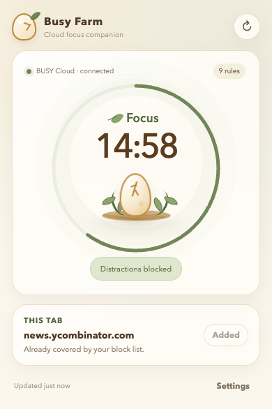
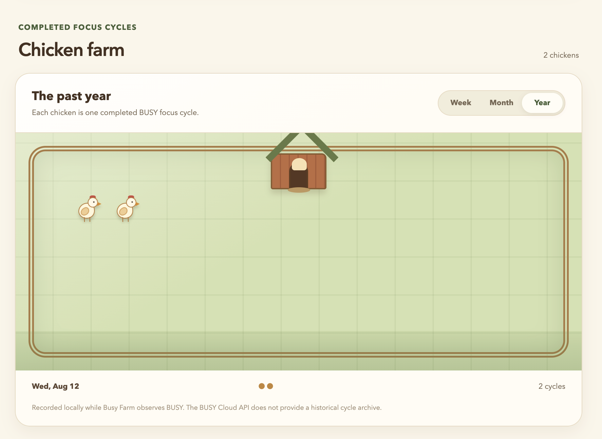
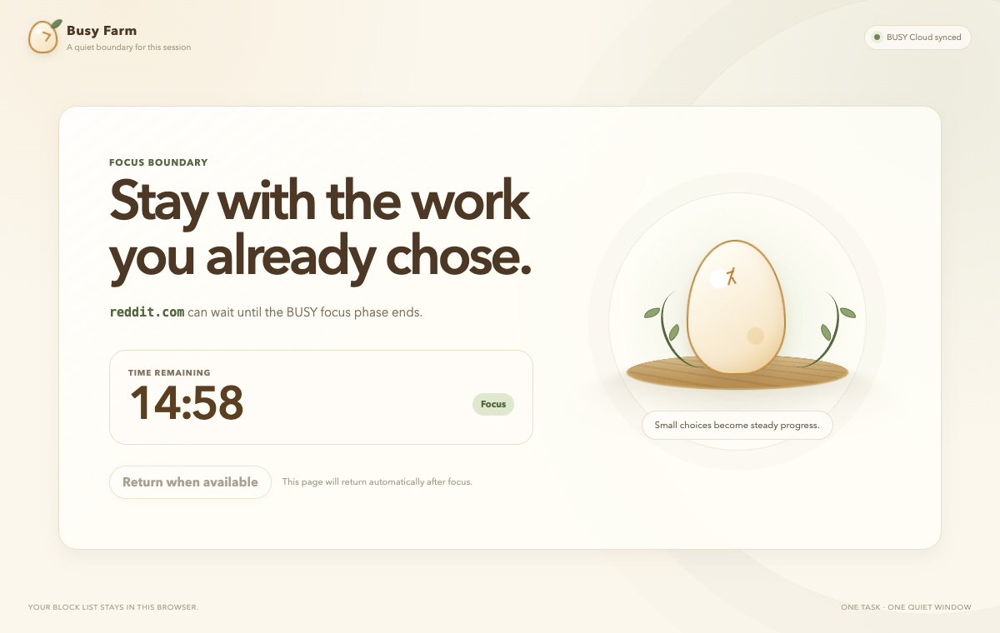

# Busy Farm

> [!IMPORTANT]
> **This project is 100% vibe coded.** (ChatGPT SOL xHigh) Its design, implementation, tests, and documentation were produced through iterative prompting and AI-assisted development. Review the source and security assumptions yourself before relying on it.
> I made it in an afternoon after being unable to connect the [BUSY Bar](https://busy.app/) with the [Forest app](https://forestapp.cc/) browser extension to block sites.

Busy Farm is a Firefox-first website blocker synchronized with a [BUSY Bar](https://busy.app/). When the device reports a running work phase, configured websites are redirected to a local focus screen. Break, idle, and completed phases release the block.

The project has no runtime or build dependencies. One source tree produces a reliable Firefox extension and a Chromium-compatible development build.

## Screenshots

<p align="center">
  
</p>

<p align="center">
  
</p>

<p align="center">
  
</p>

## What is implemented

- BUSY Cloud connection through the official internet API.
- Current snapshot polling through the official `/busybar/busy/snapshot` API.
- `NOT_STARTED`, `INFINITE`, `SIMPLE`, and `INTERVAL` timer modes.
- Work, pause, break, disconnect-grace, and session-end policies.
- Nine useful default block rules plus custom domains with optional subdomain coverage.
- Blocking of new navigations and already-open matching tabs.
- Automatic restoration of redirected tabs after focus, when possible.
- Toolbar popup with live phase, countdown, connection state, and one-click current-site addition.
- Settings interface for connection, rules, behavior, simulation, diagnostics, import, and export.
- Firefox Manifest V2 and Chromium Manifest V3 outputs from the same source.
- Unit tests plus a local BUSY API simulator.

Busy Farm uses original code and artwork. Its warm farm interface includes a state-reactive egg companion, an egg toolbar icon, and a local chicken record for completed focus cycles. The egg breathes during focus, settles during breaks, and dims when the BUSY connection is unavailable.

## Requirements

- Node.js 20 or newer.
- Firefox 128 or newer for the recommended build.
- A BUSY Bar, or the included simulator for development.

## Build and verify

From this repository:

```sh
npm run check
```

This runs all unit tests, generates both browser builds, and validates their required files. Outputs are written only to:

- `dist/firefox`
- `dist/chromium`

You can run the stages separately with `npm test`, `npm run build`, and `npm run validate`.

## Install temporarily in Firefox

1. Run `npm run build`.
2. Open `about:debugging#/runtime/this-firefox` in Firefox.
3. Select **This Firefox**.
4. Select **Load Temporary Add-on…**.
5. Choose `dist/firefox/manifest.json` from this repository.
6. Open the Busy Farm toolbar button, then select **Settings**.
7. Configure the BUSY Cloud token. The default block list is installed automatically.

Firefox removes a temporary extension when the browser exits. Reload it from the same `about:debugging` page after code changes. Permanent distribution requires packaging and signing through Mozilla Add-ons; that is intentionally outside this local development build.

## Install unpacked in Chrome or another Chromium browser

1. Run `npm run build`.
2. Open `chrome://extensions`.
3. Enable **Developer mode**.
4. Select **Load unpacked**.
5. Choose the `dist/chromium` directory.

The Chromium build is useful for UI, permissions, and blocking tests. It is not the recommended always-on BUSY integration: Manifest V3 background service workers may sleep, and Chrome alarms have a 30-second minimum period. While the popup, settings, or a blocked page is open, extension messages wake the worker and polling is much more responsive; otherwise a device transition may take up to roughly 30 seconds to be noticed.

Firefox uses a persistent background page and polls BUSY every 1–2 seconds, which matches the physical-device workflow reliably. Keeping both browsers compatible is moderate rather than difficult because the timer parser, state, UI, and most WebExtension APIs are shared. The browser-specific pieces are isolated to the manifest and blocking engine:

| Concern | Firefox | Chromium |
| --- | --- | --- |
| Background | Persistent MV2 page | MV3 service worker |
| Navigation blocking | `webRequest` redirect | Dynamic `declarativeNetRequest` rules |
| Active polling | Reliable 1–2 seconds | Best effort, 30-second alarm fallback |
| Recommended use | Daily BUSY integration | Development and UI testing |

## Connect BUSY Cloud

Busy Farm uses only the official BUSY internet API at `https://api.busy.app/busybar`. Create a [Cloud API token](https://cloud.busy.app/api-tokens) with Bar access, paste it into extension settings, then select **Test connection** and **Save and monitor**. The current authentication and snapshot contract is documented in the [BUSY HTTP API documentation](https://docs.busy.app/bar/dev/http-api); snapshot shapes are also represented in the official [BUSY TypeScript library](https://github.com/busy-app/busylib-ts).

### How the BUSY Bar link works

The extension does not connect directly to the physical Bar over Bluetooth or the local network. The connection is:

```text
Physical BUSY Bar ↔ BUSY desktop/mobile app ↔ BUSY Cloud API ↔ Busy Farm extension
```

1. You start, pause, or finish a timer from the Bar or BUSY app.
2. BUSY synchronizes that state to your account in BUSY Cloud.
3. Busy Farm authenticates with the Cloud API token and reads the current `/busybar/busy/snapshot` response.
4. The extension normalizes the snapshot into focus, paused, break, idle, or disconnected state.
5. During a focus state, matching top-level website navigations are redirected to the local blocked page. When focus ends, blocking is removed and redirected tabs can be restored.

This integration is deliberately read-only: Busy Farm never starts, pauses, cancels, or changes the timer on the Bar. The token therefore links the extension to the timer state already maintained by BUSY rather than pairing the extension directly with the hardware.

The credential is stored in `browser.storage.local` for this extension and browser profile. Reloading the same extension or installing a normal signed update preserves it because the extension ID remains unchanged. Removing the extension, clearing its site/extension data, changing the extension ID, or using another browser profile does not preserve it. Firefox temporary add-ons are removed when Firefox exits, so use **Reload** in `about:debugging` while developing rather than removing and re-adding the add-on. The token is redacted from UI state, diagnostics, and exported settings files.

BUSY Cloud returns timestamped snapshots. Busy Farm accounts for the age of a cached running snapshot, so repeatedly receiving the same snapshot does not reset the displayed countdown.

The public snapshot API does not expose an account-wide historical cycle archive. Busy Farm records completed work intervals locally while the extension is running and reconstructs earlier completed intervals in the current active interval session when the snapshot contains enough timing data. The Farm view can display the locally observed record for the past week, month, or year.

## Default block list

On first installation—or once when updating from the original build—Busy Farm adds these enabled rules with subdomain coverage:

- `instagram.com`
- `facebook.com`
- `youtube.com`
- `linkedin.com`
- `news.ycombinator.com`
- `reddit.com`
- `amazon.nl`
- `amazon.com`
- `bol.com`

The migration is versioned. Removing or disabling one of these rules afterward is respected; it will not be silently restored on the next reload.

## Test without a BUSY Bar

The settings page includes an in-extension phase override for Idle, Focus, Paused, and Break. It exercises blocking without a token or device. Set it back to **Live BUSY device** when finished. The standalone simulator remains available through `npm run simulator` for parser and client development, but the Cloud-only settings UI intentionally does not expose arbitrary local endpoints.

## Project layout

```text
manifests/             Browser-specific manifests
scripts/               Dependency-free build and validation
src/background/        Polling and state coordinator
src/blocking/          Firefox and Chromium blocking strategies
src/busy/              HTTP client, snapshot normalization, policy
src/pages/             Popup, settings, and blocked-page interfaces
src/shared/            Platform, messages, formatting, site rules
src/state/             Defaults and browser storage
tests/                 Unit tests and local simulator
```

## Privacy and safety behavior

- Website rules, credentials, runtime state, and diagnostics remain in local extension storage.
- Exported settings omit the BUSY credential.
- Host access for BUSY Cloud and the default domains is declared in the extension manifest. Custom site access is requested only when a custom rule is added or imported.
- Only top-level HTTP and HTTPS navigations are redirected; subresources are not filtered.
- On connection loss during a known focus session, blocking continues only through a bounded grace window. A timed session uses its expected end plus 30 seconds; an infinite session uses two minutes from the last successful snapshot.
- The extension never sends commands to start, pause, or modify the BUSY timer. It is a read-only follower of the device state.
